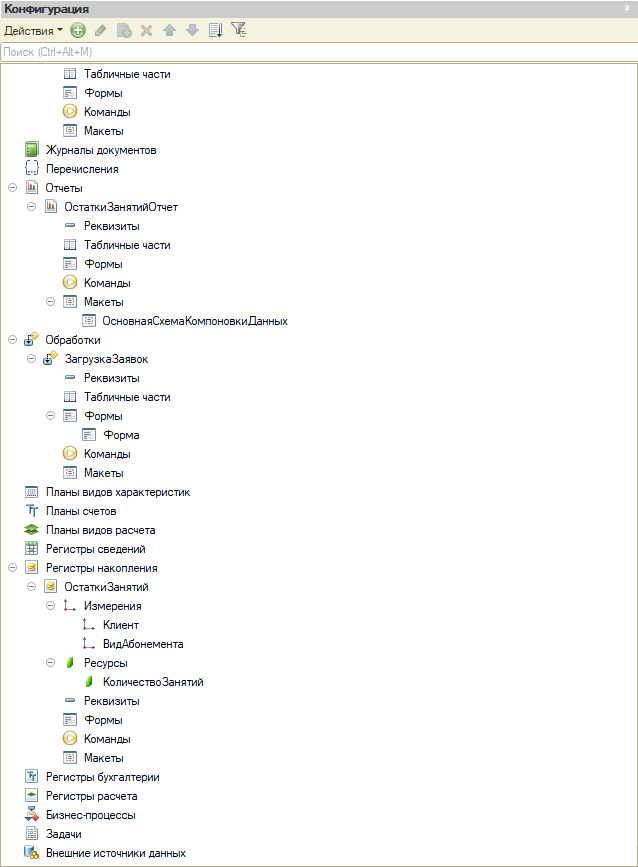
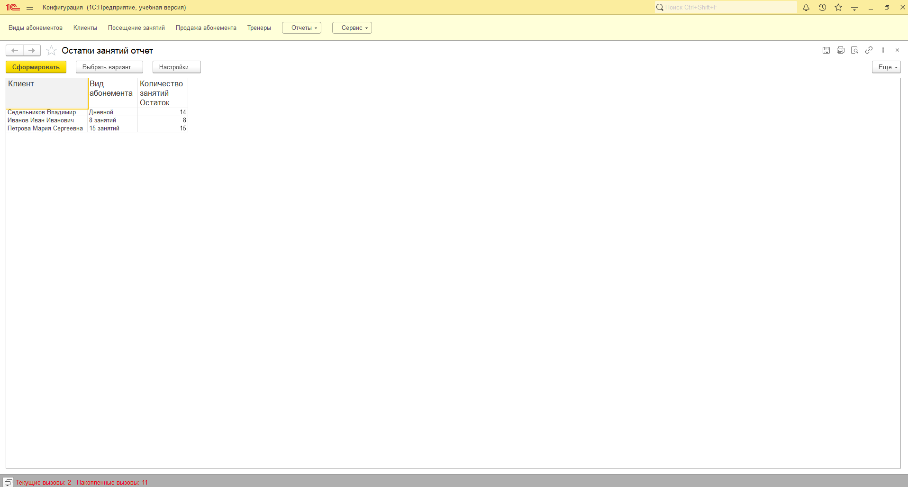
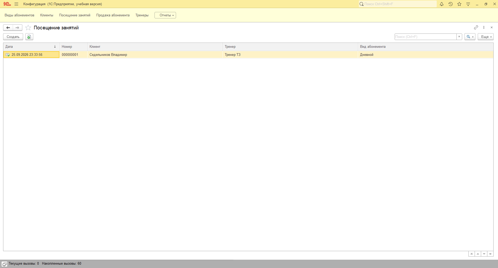
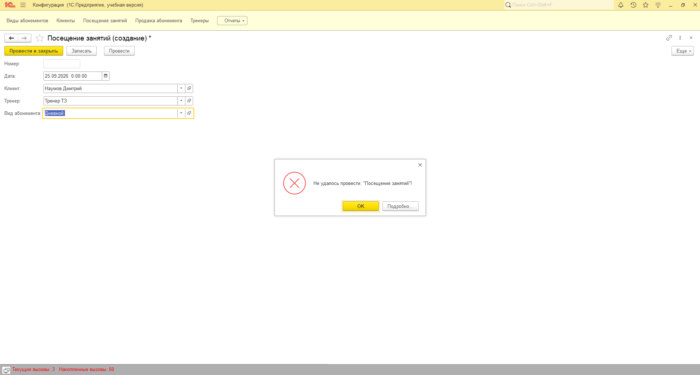
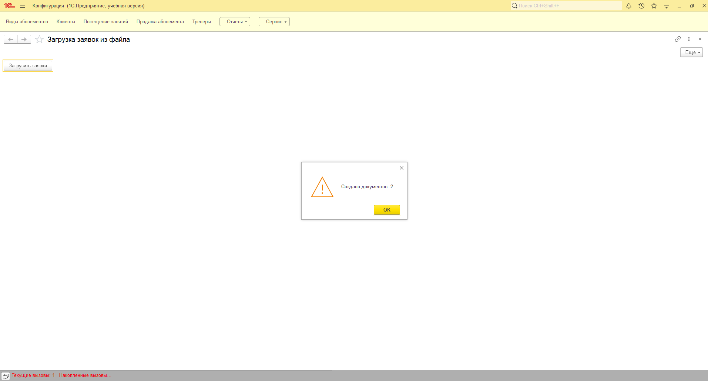
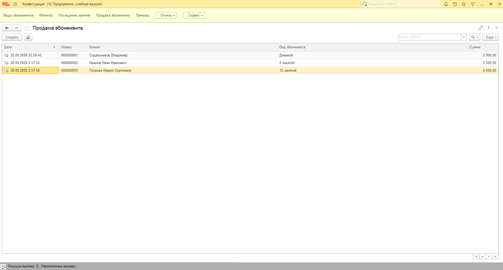

# Учёт абонементов фитнес-клуба на 1С:Предприятие 8.3

Небольшая конфигурация на платформе 1С:Предприятие 8.3 для учёта абонементов фитнес-клуба. В ней можно продать клиенту абонемент на определённое количество занятий, отметить посещение и посмотреть, сколько занятий у кого осталось.

Если у клиента не осталось занятий, система не даст отметить посещение.

Заявки на продажу абонементов можно заводить не только вручную в 1С, но и через Excel — отдельное C#-приложение читает файл заявок и готовит данные, которые 1С забирает и превращает в документы.

## Что умеет

- Вести справочники клиентов, тренеров и видов абонементов.
- Оформлять продажу абонемента: клиенту начисляется количество занятий из выбранного вида абонемента.
- Отмечать посещение: одно занятие списывается, но только если оно есть на остатке.
- Показывать отчёт по остаткам занятий в разрезе клиентов и видов абонементов.
- Массово загружать заявки на продажу абонементов из Excel-файла, минуя ручной ввод каждой заявки в 1С.

## Структура репозитория

| Папка | Назначение |
| --- | --- |
| `src/` (выгрузка конфигурации) | Конфигурация 1С:Предприятие 8.3 |
| `dotnet/FitnessClub.Orders/` | Консольное C#-приложение, готовящее файл заявок для 1С |

## Структура конфигурации



| Объект | Тип | Назначение |
| --- | --- | --- |
| Клиенты | Справочник | Клиенты клуба: ФИО, телефон, дата рождения |
| Тренеры | Справочник | Тренеры и их специализация |
| ВидыАбонементов | Справочник | Количество занятий, срок действия, цена |
| ОстаткиЗанятий | Регистр накопления (остатки) | Сколько занятий осталось у клиента по каждому виду абонемента |
| ПродажаАбонемента | Документ | Приход занятий в регистр |
| ПосещениеЗанятий | Документ | Расход одного занятия с проверкой остатка |
| ОстаткиЗанятийОтчет | Отчёт (СКД) | Текущие остатки занятий |
| ЗагрузкаЗаявок | Обработка | Загружает заявки из JSON-файла и создаёт документы продажи абонементов |

## Как это работает

Остатки занятий не хранятся в карточке клиента. Их считает регистр накопления по движениям документов:

- **Продажа абонемента** записывает приход: столько занятий, сколько указано в виде абонемента.
- **Посещение занятий** записывает расход одного занятия.

Перед списанием документ посещения запросом получает текущий остаток из виртуальной таблицы `Остатки`. Если занятий нет, проведение отменяется и пользователь видит сообщение:

```bsl
Процедура ОбработкаПроведения(Отказ, Режим)

	Запрос = Новый Запрос;
	Запрос.Текст =
	"ВЫБРАТЬ
	|	ОстаткиЗанятийОстатки.КоличествоЗанятийОстаток КАК ОстатокЗанятий
	|ИЗ
	|	РегистрНакопления.ОстаткиЗанятий.Остатки(, Клиент = &Клиент И ВидАбонемента = &ВидАбонемента)
	|	КАК ОстаткиЗанятийОстатки";

	Запрос.УстановитьПараметр("Клиент", Клиент);
	Запрос.УстановитьПараметр("ВидАбонемента", ВидАбонемента);

	РезультатЗапроса = Запрос.Выполнить();

	ОстатокЗанятий = 0;
	Если РезультатЗапроса.Пустой() = Ложь Тогда
		Выборка = РезультатЗапроса.Выбрать();
		Выборка.Следующий();
		ОстатокЗанятий = Выборка.ОстатокЗанятий;
	КонецЕсли;

	Если ОстатокЗанятий <= 0 Тогда
		Отказ = Истина;
		Сообщить("У клиента не осталось занятий по этому абонементу. Документ не проведён.");
		Возврат;
	КонецЕсли;

	Движения.ОстаткиЗанятий.Записывать = Истина;
	Движение = Движения.ОстаткиЗанятий.Добавить();
	Движение.ВидДвижения = ВидДвиженияНакопления.Расход;
	Движение.Период = Дата;
	Движение.Клиент = Клиент;
	Движение.ВидАбонемента = ВидАбонемента;
	Движение.КоличествоЗанятий = 1;

КонецПроцедуры
```

## Массовая загрузка заявок из Excel

Чтобы не заводить каждую продажу абонемента в 1С вручную, заявки можно собрать в Excel-файл и загрузить их одной кнопкой.

Схема работы:

orders.xlsx → FitnessClub.Orders.exe → orders.json → обработка "ЗагрузкаЗаявок" в 1С
(сотрудник (консольное C#- (общий файл (создаёт клиентов и проводит
заполняет приложение читает обмена) документы "ПродажаАбонемента")
таблицу) Excel и сериализует
в JSON)

### C#-приложение (`dotnet/FitnessClub.Orders`)

Консольное приложение на .NET 8, читает Excel-файл через библиотеку ClosedXML и сохраняет результат в JSON через `System.Text.Json`.

Формат `orders.xlsx` (первая строка — заголовки, данные — со второй строки):

| ФИО | Телефон | Вид абонемента |
| --- | --- | --- |
| Иванов Иван Иванович | +7 900 123-45-67 | 8 занятий |

Общая папка обмена: `C:\FitnessClubExchange\` — туда кладётся `orders.xlsx`, оттуда после запуска приложения забирается `orders.json`.

Класс `Order` валидирует каждую заявку при создании (ФИО, телефон и вид абонемента не могут быть пустыми) — некорректные данные не попадут дальше по цепочке.

### Обработка "ЗагрузкаЗаявок" в 1С

Читает `orders.json` из той же папки обмена (`C:\FitnessClubExchange\`) через встроенный в платформу объект `ЧтениеJSON` — сторонние библиотеки не нужны. Для каждой заявки:

1. Ищет вид абонемента в справочнике `ВидыАбонементов` по точному совпадению наименования. Не найден — заявка пропускается, ошибка попадает в итоговый отчёт пользователю.
2. Ищет клиента в справочнике `Клиенты` по ФИО и телефону; если не найден — создаёт нового.
3. Создаёт и проводит документ `ПродажаАбонемента` — дальше в дело вступает уже существующая логика регистра `ОстаткиЗанятий`.

## Скриншоты

Отчёт по остаткам: клиенту продали абонемент на 15 занятий, после одного посещения осталось 14.



Документ «Посещение занятий»:



Попытка отметить посещение клиенту без занятий:



Форма обработки «Загрузка заявок» — заявки прочитаны из Excel и загружены в 1С:



Результат загрузки — документы «Продажа абонемента» созданы автоматически, клиент и вид абонемента подставлены из заявки:


